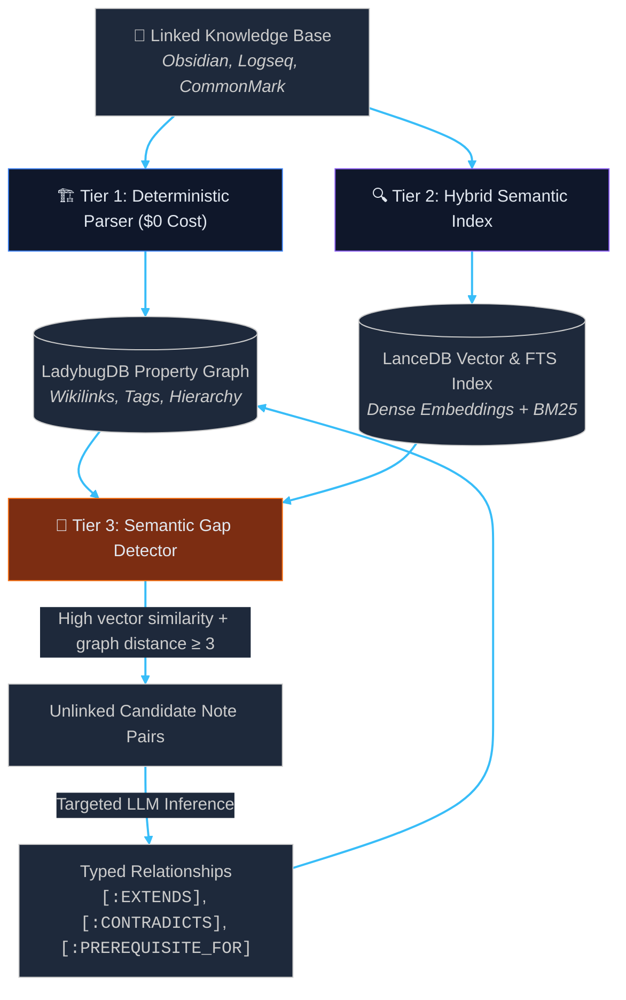

<p align="center">
  <picture>
    <source media="(prefers-color-scheme: dark)" srcset="assets/pkmrag-logo-text-dark.svg">
    
  </picture>
</p>

<p align="center">
  <strong>Embedded, Local-First Hybrid GraphRAG Retrieval Engine & MCP Server</strong>
</p>

<p align="center">
  <a href="https://github.com/dev-hashemi/project-orbit/actions"></a>
  <a href="https://github.com/dev-hashemi/project-orbit"></a>
  <a href="https://www.python.org/downloads/"></a>
  <a href="https://github.com/dev-hashemi/project-orbit/releases"></a>
  <a href="LICENSE"></a>
  <a href="http://mypy-lang.org/"></a>
</p>

PKMRAG is an open-source, local-first retrieval engine designed for linked personal knowledge bases (PKMs). While Obsidian serves as our primary reference dialect, PKMRAG operates on an abstract knowledge model supporting any linked document system (Logseq, Foam, CommonMark docs) via pluggable dialects. It combines an explicit structural property graph with an Arrow-backed vector and keyword search index, exposing contextual intelligence to frontier AI reasoning tools via the Model Context Protocol (MCP).

📖 **Technical Documentation:** [System Architecture & Subsystems](docs/architecture.md)

---

## 🏛️ Architecture Overview

PKMRAG replaces brute-force triple extraction with a targeted, 3-tier discovery pipeline:



---

## 🚀 Key Architectural Principles

- **Zero-Daemon, Embedded Storage:** Runs entirely in-process using embedded C++ and Apache Arrow engines: **LadybugDB** for property graph traversals, **LanceDB** for hybrid vector/BM25 search, and **SQLite WAL** for sub-0.5ms L1 query caching. No Docker, no network databases.
- **Dialect-Agnostic Core:** Storage, retrieval, and MCP tools operate on abstract knowledge primitives (`Note`, `Tag`, `Folder`, `LINKS_TO`). Syntax parsing is completely encapsulated in pluggable dialects.
- **Model Context Protocol (MCP):** Serves as a high-precision retrieval data plane for AI agents (**Claude Code**, **Cursor**, **OpenCode**) without exposing raw filesystem mutation risks.
- **Scientific Quality Gating:** Retrieval accuracy is benchmarked with zero-cost IR metrics (MRR, Context Recall@5) guarding against semantic regressions.

---

## 🛠️ Quickstart

### 1. Installation
Install PKMRAG into an isolated global environment using `pipx` or `uv tool`:
```bash
# Recommended for end users
pipx install pkmrag
# or
uv tool install pkmrag
```

For local development or cloning from source:
```bash
git clone https://github.com/dev-hashemi/project-orbit.git pkmrag
cd pkmrag
uv sync
```

### 2. Verify Storage & Engine Health
```bash
pkmrag doctor
```
```text
╭─────────────────────────────────────────────╮
│ PKMRAG v0.9.0 — System Health & Diagnostics │
╰─────────────────────────────────────────────╯
                       In-Process Data Plane Verification                       
┏━━━━━━━━━━━━━━━━━━━━━━━━┳━━━━━━━━━┳━━━━━━━━━┳━━━━━━━━━┳━━━━━━━━━━━━━━━━━━━━━━━┓
┃ Component              ┃ Status  ┃ Version ┃ Latency ┃ Verification Details  ┃
┡━━━━━━━━━━━━━━━━━━━━━━━━╇━━━━━━━━━╇━━━━━━━━━╇━━━━━━━━━╇━━━━━━━━━━━━━━━━━━━━━━━┩
│ LadybugDB Property     │  PASS   │ 0.20.4  │   0.3ms │ Cypher transactional  │
│ Graph                  │         │         │         │ read/write verified   │
│ LanceDB Vector Engine  │  PASS   │ 0.38.0  │   6.3ms │ Arrow-backed vector   │
│                        │         │         │         │ index verified        │
│ Ollama Local Engine    │  PASS   │ active  │   1.2ms │ Local daemon detected │
└────────────────────────┴─────────┴─────────┴─────────┴───────────────────────┘
All systems operational. Engines ready for PKMRAG.
```

### 3. Ingest and Search in 30 Seconds
```bash
pkmrag ingest /path/to/vault
pkmrag search "how does cache invalidation work?" --near "Cache Architecture.md"
```

---

## 🔍 Core Capabilities

### Ingestion & Incremental Synchronization
Ingest notes, links, tags, and semantic vectors with SHA-256 delta sync:
```bash
pkmrag ingest /path/to/vault                           # Ingest graph topology + semantic vectors
pkmrag ingest /path/to/vault --target vector           # Target specific plane (all, graph, or vector)
pkmrag ingest /path/to/docs --dialect commonmark       # Explicitly select markdown dialect
pkmrag ingest /path/to/vault --rebuild                 # Force a clean rebuild
```

### Hybrid & Graph-Boosted Retrieval
Combines dense semantic similarity (`BAAI/bge-small-en-v1.5`), Tantivy BM25 keyword matching, Reciprocal Rank Fusion ($k=60$), and graph proximity multipliers:
```bash
pkmrag search "distributed consensus"                  # Hybrid search (dense + BM25 via RRF)
pkmrag search "consensus" --near "Paxos Algorithm.md"  # Boosted by graph proximity to anchor note
pkmrag search "raft" --mode dense --limit 5            # Explicit retrieval mode (hybrid, dense, sparse)
pkmrag search "storage" --json                         # Machine-readable JSON output
```

### 🧠 Semantic Gap Discovery & Inferred Relationships
Detects unlinked note pairs with high semantic similarity ($\ge 0.80$) but graph distance $\ge 3$, classifying missing edges via local or remote LLMs:
```bash
pkmrag discover /path/to/vault --dry-run               # Preview semantic gaps without calling LLM
pkmrag discover /path/to/vault --provider ollama       # 100% offline local inference (Llama 3.2, Qwen 2.5)
pkmrag discover /path/to/vault --threshold 0.85        # Custom cosine similarity threshold
```
Inferred edges are stored separately in the LadybugDB `[:INFERRED_REL]` table with confidence, model name, and rationale—preserving human-curated wikilinks.

---

## 🔌 Model Context Protocol (MCP) & HTTP Server

PKMRAG exposes a rich tool plane over **stdio** (for CLI/IDE agents) and **HTTP/SSE** (for Obsidian and network clients):

```bash
# Start stdio MCP server (Claude Code, Cursor, OpenCode)
pkmrag serve /path/to/vault

# Start HTTP/SSE daemon on port 3747 (dual MCP SSE + REST API plane)
pkmrag serve /path/to/vault --transport http --port 3747

# One-command registration for Claude Code:
claude mcp add pkmrag -- uv run pkmrag serve /path/to/vault
```

### Exposed Tools
- `query_vault`: Hybrid semantic + BM25 keyword retrieval with graph boost and folder/tag filters.
- `read_note`: Read note content enriched with graph context (tags, forward links, backlinks).
- `list_notes`: Browse notes in the vault with optional folder filtering and pattern matching.
- `list_tags` / `search_by_tag`: Rank and query notes by tag topology.
- `get_outline`: Extract heading hierarchy and line numbers for large notes.
- `get_note_context`: Inspect incoming backlinks, outgoing citations, 2-hop clusters, and AI-inferred relationships.
- `find_bridges`: Discover the shortest link path between two notes across the vault.
- `discover_gaps`: Uncover unlinked note pairs with high vector similarity for bridging.
- `vault_overview`: Bird's-eye view of vault notes, wikilinks, tags, and central hub notes.
- `reindex_note`: Targeted sub-40ms single-note incremental reindexing after external edits.
- `sync_vault`: Incremental delta scan updating modified notes across the vault.

---

## 💎 Obsidian Desktop Plugin (`pkmrag`)

A native desktop companion plugin (`plugins/obsidian/`) connecting Obsidian to PKMRAG:
- **Interactive Setup Wizard:** If installed before the Python core engine, the sidebar automatically guides you through a 2-step setup with 1-click command copying and live verification.
- **Orbit Insights Sidebar:** Real-time semantic gap recommendations, contradiction warnings with LLM citations, and structural graph context.
- **Zero-Terminal Workflow & Auto-Daemon:** Transparently starts the background engine daemon on launch and shuts down cleanly on exit.
- **In-App AI Discovery & Indexing:** Trigger deep AI relationship discovery (`⚡ Discover`) and full vault rebuilds directly from Obsidian without opening a shell.
- **Settings-Driven LLM & Embedding Models:** Swap between Ollama, OpenAI, Groq, or local endpoints and customize models with 1-click latency verification directly inside Obsidian Settings.
- **CodeMirror 6 Inline Indicators:** Ambient visual widgets on headings (`🔗 N`, `⚠️`) without document clutter; clicking reveals the sidebar panel.
- **Proximity Concept Explorer:** Context-anchored hybrid retrieval drawer (`--near <note>`) directly within the editor with 1-click reference insertion.
- **Knowledge Governance:** Persistent negative feedback cache preventing dismissed links from recurring; transparent restoration drawer and global reset.
- **Zero-Config Token Security:** Automatically discovers `.pkmrag/server_token` (or legacy `.orbit/server_token`) from active vault.
- **Live Reactive Updates:** Subscribes to Server-Sent Events (`/api/v1/events`) for background indexing updates.

```bash
# Install companion plugin into your Obsidian vault:
pkmrag install-plugin /path/to/vault

# Or for plugin developers:
pkmrag install-plugin /path/to/vault --symlink
```

See [docs/subsystems/obsidian-plugin.md](docs/subsystems/obsidian-plugin.md) for installation and developer guides.


---

## 🎯 Benchmarks & Distributed Tracing

### Information Retrieval Quality Gates
Evaluated against the in-repo Golden 10 ground truth benchmark dataset (`benchmarks/golden_10.json`):
- **MRR (Mean Reciprocal Rank):** `0.950` (Target $\ge 0.80$, PASS)
- **Context Recall@5:** `0.950` (Target $\ge 0.80$, PASS)
- **Hits@1:** `90.0%` | **Hits@3:** `100.0%` | **Hits@5:** `100.0%`
- **Mean Average Precision (MAP@5):** `0.925`

```bash
pkmrag eval --min-mrr 0.85 --min-recall 0.80           # CI regression gate
```

### OpenTelemetry Distributed Tracing
Inspect execution timelines and token consumption in real time with in-memory OpenTelemetry spans:
```bash
pkmrag search "storage" --near "LadybugDB.md" --trace
```
```text
╭───────── Trace ID: 66d44d13f5b480b5... ─────────╮
│ 🛰️ Trace: pkmrag.search  18.42ms (HIT, hybrid)  │
│ ├── cache.lookup    0.15ms (HIT)                │
│ ├── lancedb.search   8.12ms                     │
│ ├── ladybug.hops     4.20ms (dist: 1)           │
│ └── rrf.fuse         0.18ms                     │
╰─────────────────────────────────────────────────╯
```
- **Zero Daemons Required:** Spans are collected in-memory and rendered locally.
- **LLM Token Auditing:** Tracks prompt and completion tokens per inference call.
- **Remote OTLP Exporter:** Optional live trace streaming to Langfuse, Jaeger, or Datadog via `.env`.

---

## 🧪 Development & Quality Gates

```bash
# Unit & integration tests + Golden 10 benchmark
uv run pytest

# Strict type checking
uv run mypy src tests

# Linting & code formatting
uv run ruff check . && uv run ruff format --check .

# Retrieval evaluation against benchmark
uv run pkmrag eval
```
