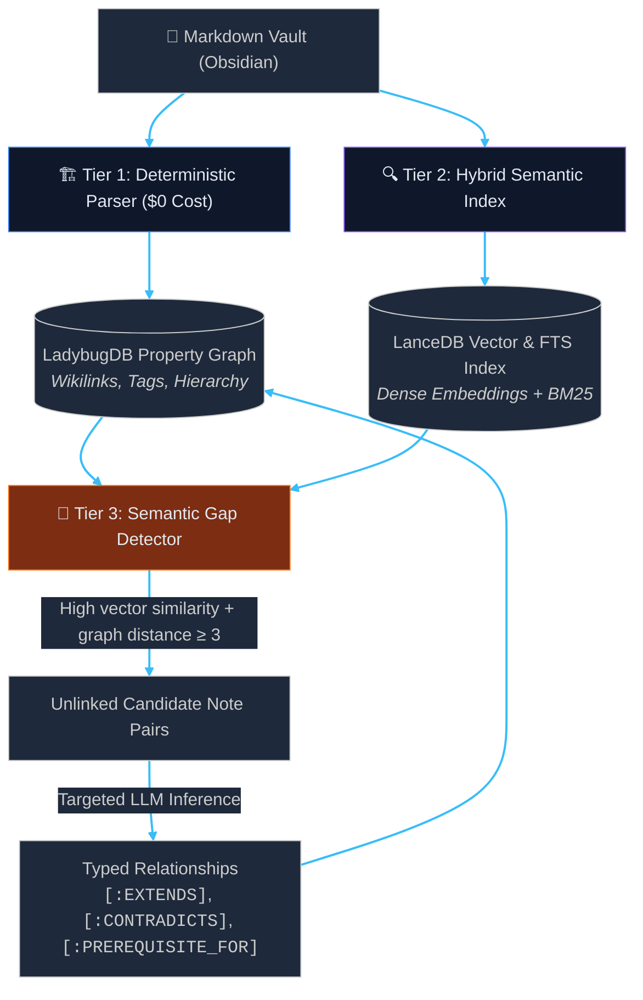

# 🛰️ Project Orbit

> **Embedded, Local-First Hybrid GraphRAG Retrieval Engine & MCP Server**

Project Orbit is an open-source, local-first retrieval engine designed for linked Markdown knowledge bases (Obsidian, personal research vaults). It combines an explicit structural property graph with an Arrow-backed vector and keyword search index, exposing contextual intelligence to frontier AI reasoning tools via the Model Context Protocol (MCP).

---

## 🏛️ Architecture Overview

Orbit replaces brute-force triple extraction with a targeted, 3-tier discovery pipeline:



---

## 🚀 Key Architectural Principles

- **Zero-Daemon, In-Process Storage:** Runs entirely in-process using embedded C++ and Apache Arrow engines (**LadybugDB** for property graph traversals, **LanceDB** for hybrid vector/BM25 search). No background Docker containers, no JVM overhead, sub-millisecond query latency.
- **Model Context Protocol (MCP):** Acts as a high-precision retrieval data plane for agents (**Claude Code, Cursor, Claude Desktop**) via standardized tool schemas without requiring direct filesystem access.
- **Scientific Quality Gating:** Benchmark regressions (Context Recall, Context Precision, MRR) measured automatically with automated evaluation suites.

---

## 🚦 Project Status

- **Phase 0 (`v0.0.1`):** In-process storage engine validation & CLI diagnostics (`orbit doctor`) — **Completed** ✅
- **Phase 1 (`v0.1.0`):** Deterministic AST wikilink backbone ingestion into LadybugDB — **Completed** ✅
- **Phase 2 (`v0.2.0`):** Hybrid vector + BM25 search with Reciprocal Rank Fusion & graph proximity boosting — **Completed** ✅
- **Phase 3 (`v0.3.0`):** FastMCP server (`query_vault`, `read_note`, `find_bridges`) — *Next*

---

## 🛠️ Quickstart

### Prerequisites
- Python `>= 3.11`
- `uv` package manager

### Installation
```bash
# Install in editable mode
uv pip install -e .
```

### Verification & Diagnostics
Run the diagnostic smoke test to verify in-process C++ and Arrow bindings:
```bash
orbit doctor
```

Output:
```text
╭────────────────────────────────────────────────────╮
│ Project Orbit v0.2.0 — System Health & Diagnostics │
╰────────────────────────────────────────────────────╯
                 Environment Details                 
 Operating System     Linux ...
 Architecture         x86_64
 Python Version       3.12.3

                       In-Process Data Plane Verification                       
┏━━━━━━━━━━━━━━━━━━━━━━━━┳━━━━━━━━┳━━━━━━━━━┳━━━━━━━━━┳━━━━━━━━━━━━━━━━━━━━━━━━━┓
┃ Component              ┃ Status ┃ Version ┃ Latency ┃ Verification Details    ┃
┡━━━━━━━━━━━━━━━━━━━━━━━━╇━━━━━━━━╇━━━━━━━━━╇━━━━━━━━━╇━━━━━━━━━━━━━━━━━━━━━━━━━┩
│ LadybugDB Property Gr… │  PASS  │ 0.20.4  │   0.3ms │ In-memory Cypher read/  │
│                        │        │         │         │ write verified (HEALTHY)│
│ LanceDB Vector Engine  │  PASS  │ 0.38.0  │   6.3ms │ Arrow-backed vector     │
│                        │        │         │         │ index verified          │
└────────────────────────┴────────┴─────────┴─────────┴─────────────────────────┘
All systems operational. Engines ready for Orbit.
```

### Ingesting a Knowledge Base
Ingest notes, links, tags, and semantic vectors with incremental delta sync:
```bash
# Ingest all planes (graph topology + semantic vectors)
orbit ingest /path/to/vault

# Ingest specific planes (all, graph, or vector)
orbit ingest /path/to/vault --target vector

# Explicitly choose a dialect (obsidian, commonmark)
orbit ingest /path/to/docs --dialect commonmark

# Force a clean rebuild
orbit ingest /path/to/vault --rebuild

# Output structured metrics in JSON
orbit ingest /path/to/vault --json
```

### Hybrid & Graph-Boosted Search
Find relevant note chunks combining dense semantic meaning, exact keyword match, and graph topology:
```bash
# Hybrid search (dense vector + sparse BM25 fused via RRF)
orbit search "how does cache invalidation work?" --vault /path/to/vault

# Graph-boosted search biased toward a specific focus note (1-2 hops away)
orbit search "vector retrieval" --vault /path/to/vault --near "Storage Layer"

# Explicit retrieval mode (hybrid, dense, or sparse)
orbit search "database schema" --mode sparse --limit 10

# Structured JSON output
orbit search "retrieval" --json
```

### Benchmarks
Retrieval accuracy is validated against the Golden 10 ground truth benchmark dataset (`benchmarks/golden_10.json`):
- **Hits@1:** `90.0%`
- **Hits@3:** `100.0%`
- **MRR (Mean Reciprocal Rank):** `0.950`

### Running Tests & Linting
```bash
# Unit & integration tests + Golden 10 benchmark
uv run pytest

# Type checking
uv run mypy src tests

# Linting & Formatting
uv run ruff check .
uv run ruff format --check .
```

