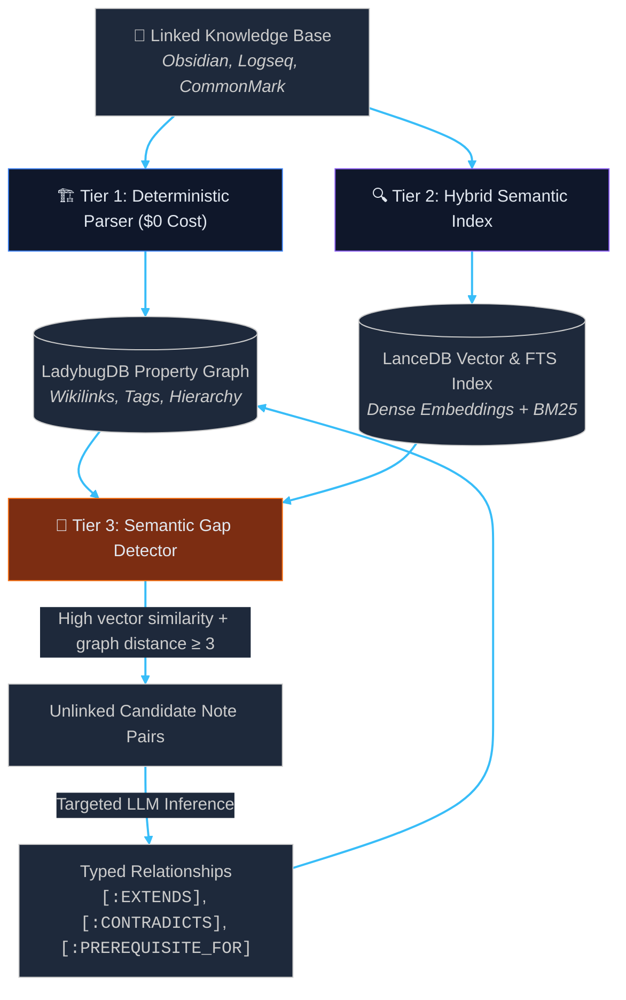

# 🛰️ Project Orbit

> **Embedded, Local-First Hybrid GraphRAG Retrieval Engine & MCP Server**

[](https://github.com/dev-hashemi/project-orbit/actions)
[](https://github.com/dev-hashemi/project-orbit)
[](https://www.python.org/downloads/)
[](https://github.com/dev-hashemi/project-orbit/releases)
[](LICENSE)
[](http://mypy-lang.org/)

Project Orbit is an open-source, local-first retrieval engine designed for linked personal knowledge bases (PKMs). While Obsidian serves as our primary reference implementation, Orbit's core property graph, vector store, and MCP retrieval tools operate on an abstract Knowledge Model supporting any linked document system (Logseq, Foam, CommonMark docs) via pluggable dialects. It combines an explicit structural property graph with an Arrow-backed vector and keyword search index, exposing contextual intelligence to frontier AI reasoning tools via the Model Context Protocol (MCP).

📖 **Technical Documentation:** [System Architecture & Subsystems](docs/architecture.md)

---


## 🏛️ Architecture Overview

Orbit replaces brute-force triple extraction with a targeted, 3-tier discovery pipeline:



---

## 🚀 Key Architectural Principles

- **Zero-Daemon, In-Process Storage:** Runs entirely in-process using embedded C++ and Apache Arrow engines (**LadybugDB** for property graph traversals, **LanceDB** for hybrid vector/BM25 search). No background Docker containers, no JVM overhead, sub-millisecond query latency.
- **Model Context Protocol (MCP):** Acts as a high-precision retrieval data plane for agents (**Claude Code, Cursor, Claude Desktop**) via standardized tool schemas without requiring direct filesystem access.
- **Scientific Quality Gating:** Benchmark regressions (Context Recall, Context Precision, MRR) measured automatically with automated evaluation suites.

---

## 🚦 Project Status

- **Phase 0 (`v0.0.1`):** In-process storage engine validation & CLI diagnostics (`orbit doctor`) — **Completed** ✅
- **Phase 1 (`v0.1.0`):** Deterministic AST wikilink backbone ingestion into LadybugDB — **Completed** ✅
- **Phase 2 (`v0.2.0`):** Hybrid vector + BM25 search with Reciprocal Rank Fusion & graph proximity boosting — **Completed** ✅
- **Phase 3 (`v0.3.0`):** Model Context Protocol (MCP) server over stdio (`query_vault`, `read_note`, `get_note_context`, `find_bridges`, `vault_overview`) — **Completed** ✅
- **Phase 4 (`v0.4.0`):** AI semantic gap detection & inferred relationships (`orbit discover`, `[:INFERRED_REL]`) — **Completed** ✅
- **Phase 5 (`v0.5.0`):** High-performance L1 query caching & on-demand digestion (`reindex_note`, `sync_vault`, WAL cache) — **Completed** ✅
- **Phase 6 (`v0.6.0`):** Automated evaluation regression harness (`orbit eval`) — *Next*


See the complete [Engineering Roadmap](docs/roadmap.md) for milestone progression through Phase 9 (`v0.9.0`).

---

## 🛠️ Quickstart

### Prerequisites
- Python `>= 3.11`
- `uv` package manager

### Installation
```bash
# Install in editable mode
uv pip install -e .
```

### Verification & Diagnostics
Run the diagnostic smoke test to verify in-process C++ and Arrow bindings:
```bash
orbit doctor
```

Output:
```text
╭────────────────────────────────────────────────────╮
│ Project Orbit v0.2.0 — System Health & Diagnostics │
╰────────────────────────────────────────────────────╯
                 Environment Details                 
 Operating System     Linux ...
 Architecture         x86_64
 Python Version       3.12.3

                       In-Process Data Plane Verification                       
┏━━━━━━━━━━━━━━━━━━━━━━━━┳━━━━━━━━┳━━━━━━━━━┳━━━━━━━━━┳━━━━━━━━━━━━━━━━━━━━━━━━━┓
┃ Component              ┃ Status ┃ Version ┃ Latency ┃ Verification Details    ┃
┡━━━━━━━━━━━━━━━━━━━━━━━━╇━━━━━━━━╇━━━━━━━━━╇━━━━━━━━━╇━━━━━━━━━━━━━━━━━━━━━━━━━┩
│ LadybugDB Property Gr… │  PASS  │ 0.20.4  │   0.3ms │ In-memory Cypher read/  │
│                        │        │         │         │ write verified (HEALTHY)│
│ LanceDB Vector Engine  │  PASS  │ 0.38.0  │   6.3ms │ Arrow-backed vector     │
│                        │        │         │         │ index verified          │
└────────────────────────┴────────┴─────────┴─────────┴─────────────────────────┘
All systems operational. Engines ready for Orbit.
```

### Ingesting a Knowledge Base
Ingest notes, links, tags, and semantic vectors with incremental delta sync:
```bash
# Ingest all planes (graph topology + semantic vectors)
orbit ingest /path/to/vault

# Ingest specific planes (all, graph, or vector)
orbit ingest /path/to/vault --target vector

# Explicitly choose a dialect (obsidian, commonmark)
orbit ingest /path/to/docs --dialect commonmark

# Force a clean rebuild
orbit ingest /path/to/vault --rebuild

# Output structured metrics in JSON
orbit ingest /path/to/vault --json
```

### Hybrid & Graph-Boosted Search
Find relevant note chunks combining dense semantic meaning, exact keyword match, and graph topology:
```bash
# Hybrid search (dense vector + sparse BM25 fused via RRF)
orbit search "how does cache invalidation work?" --vault /path/to/vault

# Graph-boosted search biased toward a specific focus note (1-2 hops away)
orbit search "vector retrieval" --vault /path/to/vault --near "Storage Layer"

# Explicit retrieval mode (hybrid, dense, or sparse)
orbit search "database schema" --mode sparse --limit 10

# Structured JSON output
orbit search "retrieval" --json
```

### 🧠 Semantic Gap Discovery & Inferred Relationships
Find unlinked note pairs exhibiting high semantic similarity and infer typed relationships via local/remote LLM:
```bash
# Dry run: discover and preview unlinked semantic gaps without calling LLM
orbit discover /path/to/vault --dry-run

# Run discovery with custom similarity threshold and classify via LLM
orbit discover /path/to/vault --threshold 0.85 --limit 10

# Output structured discovery results in raw JSON
orbit discover /path/to/vault --json
```

Inferred edges are stored separately in the LadybugDB `[:INFERRED_REL]` table with confidence, model name, and rationale—preserving human-curated wikilinks.

### Model Context Protocol (MCP) Server
Expose Orbit directly to AI assistants (**Claude Code**, **Cursor**, **Claude Desktop**) over stdio:
```bash
# Start the MCP server for an indexed vault
orbit serve /path/to/vault

# Generate copy-paste JSON configuration for Claude Desktop and Cursor
orbit mcp-config /path/to/vault
```

Exposed Tools:
- `query_vault`: Hybrid semantic + BM25 keyword retrieval with graph boost, folder, and tag filters.
- `read_note`: Read note content enriched with graph context (tags, forward links, backlinks).
- `list_notes`: Browse notes in the vault with optional folder filtering and filename pattern matching.
- `list_tags`: List all unique tags in the vault ranked by note frequency.
- `search_by_tag`: Find all notes tagged with a specific tag.
- `get_outline`: Extract heading hierarchy and line numbers for large notes.
- `get_note_context`: Inspect incoming backlinks, outgoing citations, tags, 2-hop clusters, and AI-inferred relationships.
- `find_bridges`: Discover the shortest link path between two notes across the vault.
- `discover_gaps`: Uncover unlinked note pairs with high vector similarity for bridging.
- `vault_overview`: Bird's-eye view of vault notes, wikilinks, tags, and central hub notes.
- `reindex_note`: Incrementally re-index a single note into graph and vector indices (< 40ms) after external edits.
- `sync_vault`: Scan and incrementally synchronize all modified or newly created files across the vault.


### Benchmarks
Retrieval accuracy is validated against the Golden 10 ground truth benchmark dataset (`benchmarks/golden_10.json`):
- **Hits@1:** `90.0%`
- **Hits@3:** `100.0%`
- **MRR (Mean Reciprocal Rank):** `0.950`

### Running Tests & Linting
```bash
# Unit & integration tests + Golden 10 benchmark
uv run pytest

# Type checking
uv run mypy src tests

# Linting & Formatting
uv run ruff check .
uv run ruff format --check .
```

