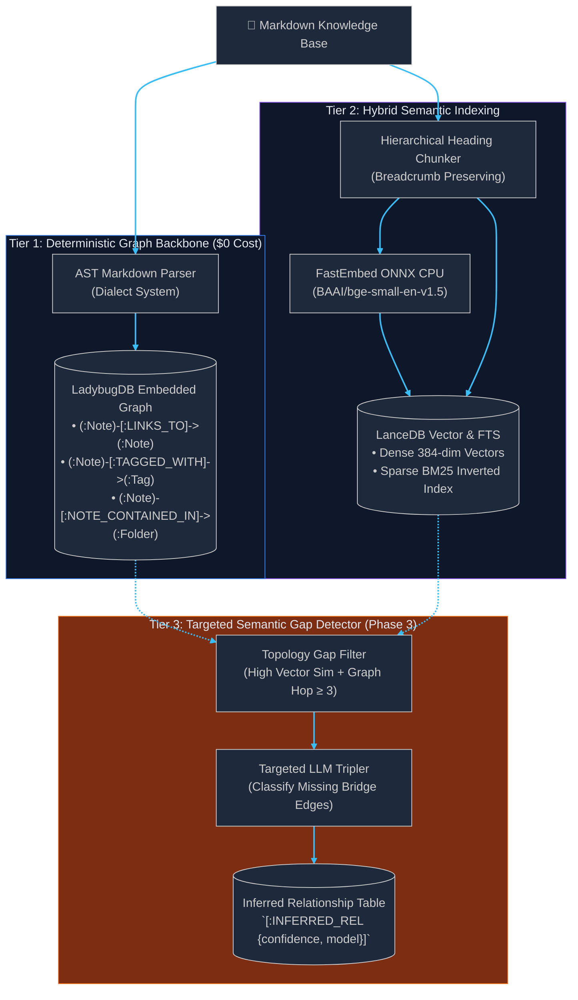

# System Architecture & Design Decisions

This document details the architectural foundation, core design decisions, and system boundaries of Project Orbit.

---

## 🏛️ The Problem: Why Traditional GraphRAG Fails on Personal Vaults

Traditional GraphRAG solutions (e.g., Microsoft GraphRAG) extract knowledge graphs from uncurated text by prompting Large Language Models to discover entity-relation-entity triples:
$$\text{Document Chunk} \xrightarrow{\text{LLM Prompt}} (\text{Subject}, \text{Predicate}, \text{Object})$$

While suitable for unstructured corporate dumps, applying this to personal research vaults (like Obsidian) introduces severe failure modes:
1. **Excessive Cost & Latency:** Vaults containing thousands of notes require millions of input tokens, costing \$50–\$200+ per full indexing run and taking hours.
2. **Ontological Hallucination:** LLMs invent arbitrary, synonymous relation types (`[:RELATES_TO]`, `[:ASSOCIATED_WITH]`, `[:CONNECTS_TO]`) causing graph noise.
3. **Ignoring Human Effort:** Note-takers have already spent hundreds of hours explicitly connecting notes via wikilinks (`[[Note B]]`), folder hierarchies, and tags.

---

## 🛰️ Orbit's 3-Tier Discovery Model

Orbit replaces unconstrained triple extraction with a **deterministic-first, targeted discovery pipeline**:

1. **Tier 1 (Deterministic Structural Backbone):** Parses explicit wikilinks, tags, and directory trees into LadybugDB with zero LLM API calls.
2. **Tier 2 (Hybrid Semantic Search):** Splits notes along Markdown headings into context-preserved chunks, indexes them into LanceDB with dense embeddings and native BM25 full-text search, and fuses results using Reciprocal Rank Fusion (RRF).
3. **Tier 3 (Targeted Semantic Gap Detector):** Identifies pairs of notes that have high semantic similarity (e.g., cosine similarity $> 0.82$) but no topological connection in the graph ($\text{hops} \ge 3$). Only these pairs are passed to an LLM to discover missing conceptual links.

---

## 📐 Architecture Decision Records (ADRs)

### ADR 1: Embedded In-Process Storage vs. Client-Server Databases
- **Decision:** Use **LadybugDB** (embedded C++ OpenCypher property graph) and **LanceDB** (embedded Apache Arrow columnar vector engine).
- **Rationale:**
  - Zero deployment friction: No Docker, no background daemon services, no TCP connection overhead.
  - Sub-millisecond latency: Queries execute in-process within shared memory space.
  - Portable storage: Graph and vector indices live locally in `<vault>/.orbit/` alongside note files.

### ADR 2: Dialect Strategy Pattern for Markdown Formats
- **Decision:** Decouple format-specific parsing into pluggable dialect strategies via [`KnowledgeDialect`](../src/orbit/dialects/base.py).
- **Rationale:**
  - Obsidian uses double bracket syntax (`[[Note Title|Alias]]`, `![[Image.png]]`), block references (`^block`), and hashtag metadata.
  - Other tools (CommonMark, Logseq, Foam, Roam Research) use standard Markdown links (`[text](url)`), page properties, or outline bullets.
  - The core indexing pipeline remains format-agnostic. New vault types only require a single new dialect class registered with `DialectRegistry`.

### ADR 3: Pure Model Context Protocol (MCP) Interface
- **Decision:** Expose Orbit capabilities strictly as an MCP server (stdio and SSE) rather than building a custom chat frontend or GUI.
- **Rationale:**
  - Frontier AI reasoning environments (Cursor, Claude Code, Windsurf, Claude Desktop) already provide superior chat interfaces and code editing workflows.
  - Orbit functions as a retrieval substrate for these agents, exposing deterministic tools (`query_vault`, `read_note`, `find_bridges`).

### ADR 4: Segregation of Ground Truth and Inferred Knowledge
- **Decision:** Inferred AI relationships are stored in separate edge tables with metadata (`confidence: float`, `model: str`, `timestamp: float`).
- **Rationale:**
  - Human-curated notes are authoritative ground truth.
  - Graph traversals default to explicit edges unless proximity expansion explicitly permits inferred links.
  - Allows easy retraction or recalculation of AI links when switching embedding or LLM models without altering human data.
