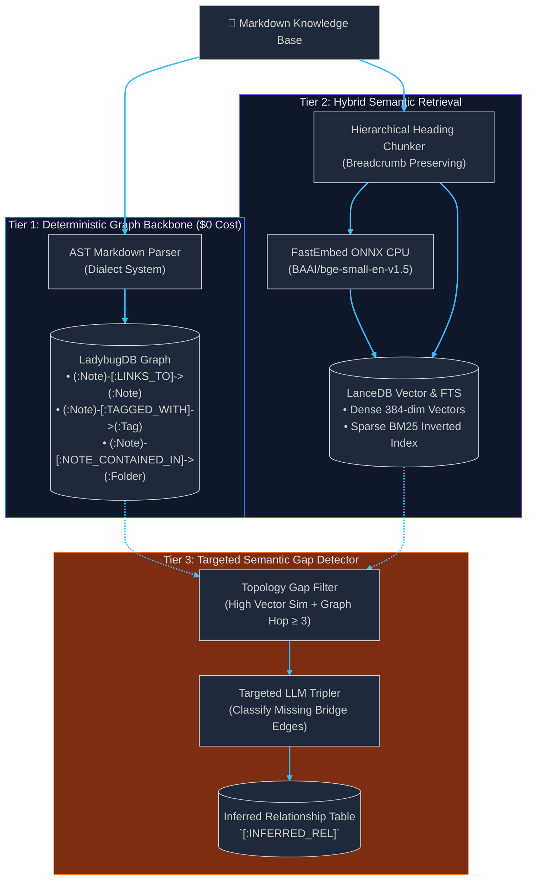

  <picture>
    <source media="(prefers-color-scheme: dark)" srcset="../assets/pkmrag-logo-text-dark.svg">
    
  </picture>

# System Architecture

PKMRAG is an embedded, local-first Hybrid GraphRAG retrieval engine and MCP server designed for linked Markdown knowledge bases.

---

## 🏛️ 3-Tier Discovery Pipeline

PKMRAG eliminates costly brute-force LLM triple extraction by structuring discovery into three distinct tiers:

1. **Tier 1 (Deterministic Graph Backbone):** Extracts explicit wikilinks, tags, and directory hierarchies into LadybugDB with zero LLM API calls.
2. **Tier 2 (Hybrid Semantic Search):** Splits notes along headings, indexes dense embeddings and native BM25 in LanceDB, and fuses them via Reciprocal Rank Fusion (RRF) with graph proximity boosting.
3. **Tier 3 (Semantic Gap Detector):** Targets unlinked note pairs exhibiting high semantic similarity but graph distance $\ge 3$, applying targeted LLM inference to uncover missing relationships.

---

## 🗺️ Subsystems Directory

- [**Graph Engine**](subsystems/graph-engine.md): LadybugDB OpenCypher schema and undirected hop traversal.
- [**Search Engine**](subsystems/search-engine.md): LanceDB Arrow dataset, FastEmbed ONNX inference, and native BM25 full-text search.
- [**Ingestion Pipeline**](subsystems/ingestion.md): Markdown dialect strategies, SHA-256/mtime incremental sync, and ghost note reconciliation.
- [**Hybrid Search & Ranking**](subsystems/hybrid-search.md): Hierarchical heading chunker, Reciprocal Rank Fusion ($k=60$), and graph proximity multipliers.
- [**MCP Server**](subsystems/mcp.md): Model Context Protocol stdio server, tool definitions, and client configuration.
- [**Caching & On-Demand Digestion**](subsystems/caching.md): SQLite L1 query cache with composite hashing, dependency invalidation, and sub-40ms single-note reindexing.
- [**Observability & Tracing**](subsystems/observability.md): OpenTelemetry span hierarchy, visual terminal waterfall trees, and token auditing.
- [**Local Model Inference**](subsystems/local-inference.md): Offline relationship classification with Ollama, conversational validation retry, and token-bucket bypass.
- [**HTTP & SSE Server Transport**](subsystems/http-transport.md): Dual-protocol Starlette server hosting MCP SSE, REST APIs, Bearer auth, and live event broadcasting.
- [**Obsidian Desktop Plugin**](subsystems/obsidian-plugin.md): Native companion plugin surfacing AI gaps, contradiction warnings, and debounced save synchronization.
- [**Benchmarks**](subsystems/benchmarks.md): Golden 10 and Obsidian Help 50 ground truth datasets and evaluation metrics.
- [**Architecture Decision Records (ADRs)**](adr/): Historical design decisions and rationale.

