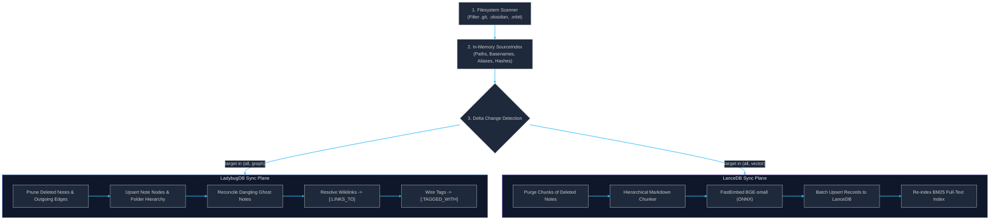

# Ingestion Pipeline & Chunking Engine

The ingestion pipeline ([`src/orbit/ingest/pipeline.py`](file:///home/ali/projects/my/project-orbit/src/orbit/ingest/pipeline.py)) transforms a directory of linked Markdown documents into an interconnected property graph and an optimized vector/BM25 index.

---

## 🔄 Two-Plane Synchronization Pipeline

Ingestion operates across two distinct data planes that can be updated concurrently or independently via the `--target [all|graph|vector]` CLI option:



---

## ⚡ Incremental Delta Change Detection

Re-indexing an entire vault on every command is unacceptable. Orbit employs a **two-tier hash and timestamp cache**:

1. **Graph Plane (SHA-256 Content Hash):**
   - For every scanned file, Orbit computes its SHA-256 digest.
   - The digest is compared against `n.hash` in LadybugDB.
   - If `n.hash == file_hash` and `not n.is_unresolved`, the note's nodes and relationships are left untouched.
2. **Vector Plane (Filesystem `mtime`):**
   - In LanceDB, the `chunks` table records the `mtime` of the source file.
   - If the disk file's `mtime` matches the vector store's recorded `mtime`, embedding generation is skipped.

**Performance Impact:**
- Full cold ingest of 1,000 notes: ~10–25 seconds.
- Incremental sync when 0 files changed: **< 150 milliseconds** (throughput > 85 notes/sec).

---

## 🧩 Hierarchical Heading Chunker

Fixed-size token window chunkers (e.g., standard LangChain 500-token chunks with 50-token overlap) fail on structured Markdown:
- They break sentences mid-thought.
- They separate code blocks from their explanatory paragraphs.
- They strip heading context, meaning chunks lack semantic grounding.

Orbit implements an AST-aware **Hierarchical Markdown Chunker** ([`chunker.py`](file:///home/ali/projects/my/project-orbit/src/orbit/search/chunker.py)):

### 1. Breadcrumb Hierarchy Tracking
Orbit tracks `#` through `######` headings in a stack. Every section inherits the full lineage of parent headings:
```
# System Architecture > ## Storage Plane > ### LadybugDB Driver
```
This breadcrumb string is prepended directly to the chunk text prior to embedding and BM25 indexing. When a user searches for *"storage driver"*, the chunk matches even if the body paragraph only discusses *"connection pooling"*.

### 2. Micro-Section Coalescing (`< 40` tokens)
Notes often contain brief transitional headings or single-bullet subheadings:
```markdown
### Edge Cases
None discovered yet.
```
Isolated into a standalone chunk, this produces low-quality vector noise. Orbit automatically merges micro-sections into adjacent sections under the same heading tree.

### 3. Macro-Section Splitting (`> 500` tokens)
When a section exceeds the `max_tokens` budget (default: 500 tokens), Orbit splits along double-newline paragraph boundaries (`\n\n`) rather than arbitrary token counts. Each subchunk retains the breadcrumb header:
```
Chunk 0: # Title > ## Architecture (Paragraphs 1-3)
Chunk 1: # Title > ## Architecture (Paragraphs 4-6)
```

---

## 👻 Ghost Note Reconciliation Lifecycle

In linked knowledge bases, users frequently create wikilinks to notes that do not yet exist on disk:
```markdown
We need to refactor this to match the [[Distributed Cluster Spec]].
```

### The Problem
If the target note does not exist on disk, a naive parser either drops the link (destroying the graph topology) or creates an invalid dangling reference.

### The Orbit Solution
1. **Ghost Materialization:** During link resolution, if `Distributed Cluster Spec.md` is missing from disk, Orbit inserts a **ghost node**:
   ```cypher
   MERGE (b:Note {path: 'Distributed Cluster Spec.md'})
   ON CREATE SET b.title = 'Distributed Cluster Spec',
                 b.hash = '',
                 b.mtime = 0.0,
                 b.is_unresolved = true;
   ```
   The `[:LINKS_TO]` edge is successfully created in the graph.
2. **Atomic Reconciliation:** When the user subsequently creates `Distributed Cluster Spec.md` on disk:
   - The ingestion pipeline detects that the new note matches the title of a ghost node.
   - It re-points all incoming `[:LINKS_TO]` edges from the ghost node to the real node.
   - The ghost node is deleted.
   - Zero links are lost, maintaining complete graph integrity.
