# Subsystem: L1 Query Caching & On-Demand Digestion

Project Orbit incorporates a high-performance, embedded L1 query cache and a sub-40ms targeted single-note reindexing engine. This provides sub-millisecond retrieval on repeat queries and enables frontier AI agents (Claude Code, Cursor) and humans (Obsidian) to synchronize external note edits in real time without full vault scans.

---

## 🏛️ Architecture & Lifecycles

```mermaid
%%{init: {'theme': 'dark', 'themeVariables': { 'darkMode': true, 'background': 'transparent', 'mainBkg': '#1e293b', 'primaryColor': '#1e293b', 'primaryBorderColor': '#3b82f6', 'primaryTextColor': '#f8fafc', 'lineColor': '#38bdf8', 'edgeLabelBackground': '#1e293b' }}}%%
flowchart TD
    subgraph ReadPath["⚡ L1 Query Cache (< 0.5ms on hit)"]
        Q["Incoming query_vault(...)"]
        Q --> Key["Composite Key Hashing\nSHA256(query + mode + near + limit + folder + tags)"]
        Key --> L1{"L1: SQLite Cache\n(WAL mode)"}
        L1 -->|"✅ Hit (< 0.5ms)"| Ret["Return Cached SearchResults"]
        L1 -->|"❌ Miss"| Full["Execute Hybrid Search Pipeline\nFastEmbed + LanceDB + BM25 + RRF"]
        Full --> Store["Save Results to L1 Cache\nRecord (cache_key, note_path) Dependencies"]
        Store --> Ret
    end

    subgraph SyncPath["🔄 On-Demand Digestion (< 40ms)"]
        Edit["External Edit\n(Claude / Cursor / Obsidian)"] --> Call["reindex_note(path) / sync_vault()"]
        Call --> Lock["Acquire Write Mutex Lock"]
        Lock --> AST["Parse Note AST (Dialect)\nExtract Wikilinks, Tags, Frontmatter"]
        AST --> Graph["Update LadybugDB\nUpsert Note, Reconcile Ghosts, Re-wire Edges"]
        AST --> Vec["Update LanceDB\nChunk Note, FastEmbed Chunks, Upsert Vectors"]
        Vec --> Evict["Evict Stale Cache Entries\nDELETE FROM query_cache WHERE note_path = :path"]
        Evict --> Unlock["Release Write Mutex Lock"]
        Unlock --> Done["Return Structured SyncResult\n(chunks, links, tags updated in < 40ms)"]
    end

    style L1 fill:#064e3b,stroke:#10b981,color:#e2e8f0
    style Ret fill:#064e3b,stroke:#10b981,color:#e2e8f0
    style Lock fill:#7c2d12,stroke:#ef4444,color:#e2e8f0
    style Done fill:#0f172a,stroke:#38bdf8,color:#e2e8f0
```



---

## ⚡ L1 SQLite Query Cache

### 1. Composite Key Formulation
Search requests are heavily parameterized. Hashing solely on raw query text causes severe cache contamination across different search parameters. Orbit computes a canonical SHA-256 composite hash over all execution arguments:

$$\text{Key} = \text{SHA256}\Big(\text{norm}(q) \mathbin{\Vert} \text{mode} \mathbin{\Vert} \text{near} \mathbin{\Vert} \text{limit} \mathbin{\Vert} \text{folder} \mathbin{\Vert} \text{sorted\_tags}\Big)$$

- Normalized whitespace and case insensitivity.
- Tag list order-invariant (`["db", "arch"]` produces the same key as `["arch", "db"]`).

### 2. Inverted Note Dependency Tracking (`cache_dependencies`)
To avoid flushing the entire cache when a single document is modified, Orbit records reverse dependencies between cached queries and the notes included in their result sets:
- **Table `query_cache`:** Stores serialized `SearchResult` JSON, created timestamp, and LRU access timestamp.
- **Table `cache_dependencies`:** Maps `(cache_key, note_path)`.
- When note `DocA.md` is modified, Orbit executes:
  ```sql
  DELETE FROM query_cache WHERE cache_key IN (
      SELECT cache_key FROM cache_dependencies WHERE note_path = 'DocA.md'
  );
  ```
  Queries unrelated to `DocA.md` remain warm in the cache.

### 3. Concurrency & Eviction
- **WAL Mode:** Initialized with `PRAGMA journal_mode = WAL;`, `PRAGMA synchronous = NORMAL;`, and `PRAGMA busy_timeout = 5000;`.
- **LRU Pruning:** When entry count exceeds `cache_max_entries` (default 1000), the oldest 10% of entries sorted by `last_accessed_at` are automatically pruned.
- **Graceful Degradation:** Cache read/write errors are logged as warnings and never interrupt search execution.

---

## 🔄 Targeted Single-Note Reindexer (`SingleNoteReindexer`)

Full vault scans on large vaults (5,000+ notes) can take several seconds. The `SingleNoteReindexer` performs isolated, incremental digestion in **< 40ms**:

1. **Security & Containment:** Validates that the requested path resides strictly within vault boundaries and does not intersect with internal directories (`.orbit`, `.git`, `.obsidian`).
2. **Deterministic AST Extraction:** Uses the active dialect to parse frontmatter, extract wikilinks, and collect tags.
3. **Graph Synchronization (LadybugDB):**
   - Deletes prior outgoing relationships for the note (`delete_outgoing_edges`).
   - Upserts the Note node with fresh hash and mtime.
   - Reconciles dangling ghost notes if the note was previously an unresolved link target.
   - Adds new `TAGGED_WITH`, `LINKS_TO`, and `NOTE_CONTAINED_IN` edges.
4. **Vector Synchronization (LanceDB):**
   - Re-chunks the modified document preserving heading context.
   - Computes dense vector embeddings via FastEmbed ONNX CPU.
   - Calls `upsert_chunks()`, which replaces old chunks and immediately updates Tantivy FTS.
5. **Reverse Invalidation:** Triggers cache eviction for the modified note path.

---

## 🛠️ MCP Integration

Frontier agents interact with the digestion subsystem via two Model Context Protocol tools:
- **`reindex_note(note_path)`:** Re-indexes a single modified note immediately after an external file edit.
- **`sync_vault()`:** Scans file mtimes across the vault and re-indexes all modified, newly added, or deleted files.
