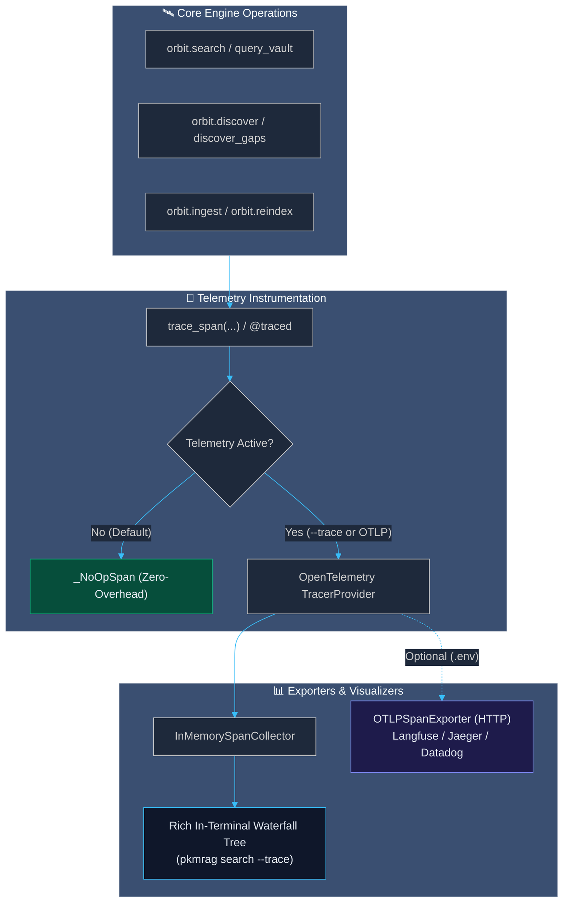

# Subsystem: Observability & Distributed Tracing

Project Orbit instruments its entire retrieval, inference, ingestion, and MCP execution pipeline with OpenTelemetry standards. This gives developers, agent engineers, and users instant visual breakdowns of where query latency is spent, audits token usage across LLM calls, and quantifies the exact token savings achieved by LadybugDB graph pruning.

---

## 🏛️ Architecture & Principles



### Core Tenets
1. **Zero External Daemon Dependency**: Orbit requires no running servers or Docker containers to trace operations. Spans are collected into an in-memory buffer (`InMemorySpanCollector`) and rendered directly into the terminal as a waterfall tree.
2. **Zero-Overhead Default**: When tracing is not enabled, `trace_span` yields `_NoOpSpan` without instantiating OpenTelemetry contexts, making the baseline execution overhead sub-microsecond.
3. **Strict MCP Stdio Wire Protocol Safety**: All trace warnings, exporter errors, and debug outputs strictly write to `stderr` or internal memory buffers. `stdout` remains pristine JSON-RPC for Claude and Cursor.
4. **OpenTelemetry Semantic Conventions**: Attributes follow OpenTelemetry standards (`gen_ai.usage.prompt_tokens`, `gen_ai.usage.completion_tokens`, `model`) alongside domain-specific graph attributes (`cache.hit`, `pruned_by_graph`).

---

## 🌲 Span Hierarchies

### 1. Hybrid Search (`orbit.search` / `orbit.mcp.query_vault`)
```
[orbit.search] ─────────────────────────────────────────────── Total: 645ms
 ├── [cache.lookup] ────────────────────────── 0.1ms  (MISS)
 ├── [embed.query] █████████████████████████ 599.5ms  (384-dim)
 ├── [lancedb.dense_search] █                 15.0ms  (limit=50)
 ├── [lancedb.sparse_search] █                 9.3ms  (BM25)
 ├── [rrf.fuse] ────────────────────────────── 0.2ms  (k=60)
 ├── [ladybug.proximity_boost] ─────────────── 1.2ms  (hops=2)
 └── [cache.store] █                          19.9ms  (sqlite L1)
```

On subsequent queries with identical arguments, the L1 query cache short-circuits execution:
```
[orbit.search] ────────────────────────────── Total: 20ms
 └── [cache.lookup] █████████████████████████ 20.1ms  (HIT, hybrid)
```

### 2. Semantic Gap Discovery (`orbit.discover` / `orbit.mcp.discover_gaps`)
```
[orbit.discover] ───────────────────────────────────────────── Total: 1840ms
 ├── [gap.vector_ann] █████████              320.0ms  (threshold=0.80)
 ├── [gap.graph_filter] ███████              240.0ms  (pruned: 14, candidates: 6)
 └── [llm.classify_relationship] ██████████ 1280.0ms  (182 tok, EXTENDS)
```

---

## ⚡ Token Usage & Graph Pruning Efficiency

Orbit's 2-hop topological filtering in LadybugDB eliminates candidate pairs that are already logically linked before they reach expensive LLM inference. The telemetry subsystem tracks both actual token consumption and the context tokens saved by topology pruning:

$$\text{Tokens Saved} = (\text{Raw Candidates} - \text{Filtered Candidates}) \times \text{Average Excerpt Tokens}$$

These metrics appear directly in `DiscoveryStats` and span attributes (`tokens_saved_by_graph`, `tokens.prompt`, `tokens.completion`, `tokens.total`).

---

## 💻 CLI Usage

Inspect any search or discovery execution in real time:

```bash
# Search with visual trace breakdown
uv run pkmrag search "vector retrieval" --trace

# Search with note proximity bias and trace
uv run pkmrag search "storage" --near "LadybugDB.md" --trace

# Vault ingestion trace
uv run pkmrag ingest ./my-vault --trace

# Dry-run gap discovery trace
uv run pkmrag discover ./my-vault --dry-run --trace
```

---

## 🌐 External OTLP Export (Langfuse / Jaeger)

To forward traces to an OpenTelemetry-compatible collector, configure standard environment variables in `<vault>/.orbit/.env` or system environment:

```env
ORBIT_TRACING_ENABLED=true
ORBIT_OTLP_ENDPOINT="https://cloud.langfuse.com/api/public/otel/v1/traces"
ORBIT_OTLP_HEADERS="Authorization=Basic <base64-credentials>"
ORBIT_SERVICE_NAME="project-orbit"
```
